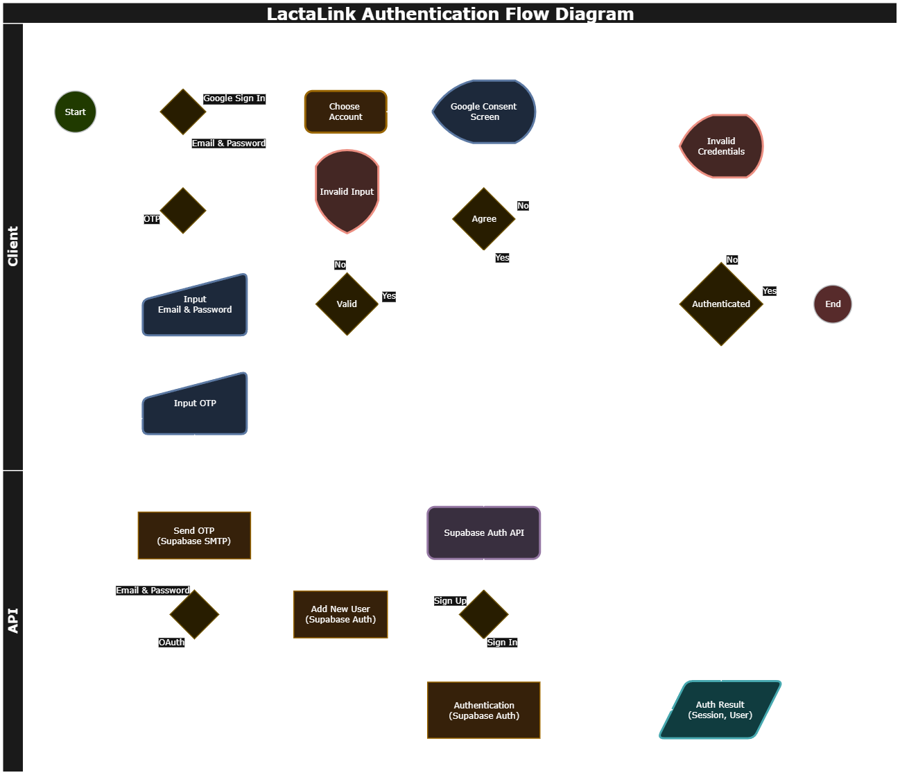

# LactaLink Authentication

This document details the authentication system implemented in LactaLink, outlining the architecture, implementation details, and workflows for secure user authentication across both client and server components.

## Overview

LactaLink uses a custom authentication strategy that integrates Supabase Auth with Payload CMS. This approach provides robust authentication capabilities while maintaining data synchronization between Supabase Auth users and Payload CMS users.



## Core Components

### Integration Architecture

The authentication system consists of the following key components:

1. **Supabase Auth**: Primary authentication provider handling user registration, login, and session management
2. **Payload CMS**: Content management system with extended user schema linked to Supabase Auth
3. **Database Triggers**: Automated synchronization between Supabase Auth and Payload CMS users
4. **Custom Auth Strategy**: Middleware that validates authentication tokens and retrieves user information
5. **API Client**: Frontend abstraction layer that handles authentication header management

### Database Schema Extensions

The Payload CMS Users collection schema is extended to include a crucial link to Supabase Auth:

```typescript
// In payload.config.ts
db: postgresAdapter({
  // Other configurations...
  beforeSchemaInit: [
    ({ schema, adapter }) => {
      if (!adapter.rawTables.users) {
        console.warn('Users table not found in raw tables');
        return schema;
      }
      // Add auth_id column to link with Supabase Auth users
      adapter.rawTables.users.columns.authId = {
        name: 'auth_id',
        type: 'uuid',
        notNull: false,
      };
      return schema;
    },
  ],
}),
```

This `auth_id` field serves as a foreign key that links Payload CMS users with Supabase Auth users, enabling seamless synchronization between the two systems.

## Implementation Details

### Database Synchronization

Synchronization between Supabase Auth and Payload CMS users is managed through database triggers:

1. **`insertUserOnAuthUserInsert.sql`**: Creates a Payload user when a new Supabase Auth user is registered
2. **`updateUsersOnAuthUpdate.sql`**: Updates Payload user when Supabase Auth user information changes
3. **`deleteUserOnAuthUserDelete.sql`**: Removes Payload user when a Supabase Auth user is deleted
4. **`deleteAuthUserOnUsersDelete.sql`**: Removes Supabase Auth user when a Payload user is deleted

These triggers ensure that user data remains consistent across both systems.

### Custom Authentication Strategy

The custom authentication strategy replaces Payload's default authentication:

```typescript
import { users } from '@db/drizzle/schema';
import { eq } from '@payloadcms/db-postgres/drizzle';
import { extractToken } from '@/lib/utils/extractToken';

// Simplified representation of the auth strategy
export const authStrategy: PayloadAuthStrategy = async ({ req, res }) => {
  // Extract the Bearer token from Authorization header
  const token = extractToken(req);

  try {
    const supabaseClient = createClient(/* config */);

    const {
      data: { user },
      error,
      // Verify token with Supabase Auth by getting the user
    } = await supabaseClient.auth.getUser(token);

    if (error || !user) {
      return null;
    }

    // Since the 'auth_id' field is not managed by Payload, we cant use the payload local api
    // to find the payload user. Instead, we query the database directly.
    // Thankfully, payload exposes the Drizzle ORM via req.payload.db.drizzle
    const [authenticatedUser] = await req.payload.db.drizzle
      .select({ id: users.id })
      .from(users)
      .where(eq(users.authId, user.id))
      .limit(1);

    // Now that we have the authenticated payload user, we can return its full details
    // using the local api.
    const userDoc = await payload.findByID({
      id: authenticatedUser.id,
      collection: 'users',
      depth: collection.config.auth.depth,
    });

    // Construct the user object to return
    const payloadUser: AuthStrategyResult['user'] = {
      ...userDoc,
      collection: collectionSlug,
      _strategy: strategyName,
    };

    return { user: payloadUser };
  } catch (error) {
    console.error('Authentication error:', error);
    return null;
  }
};
```

This strategy:

1. Extracts the Bearer token from the Authorization header
2. Validates the token with Supabase Auth
3. Retrieves the associated Payload user via the `auth_id` field
4. Returns the Payload user object or null if authentication fails

### API Client Implementation

The API client in `packages/api` abstracts authentication header management:

```typescript
// Simplified representation of API client token handling
private _getFetchOptions = async (): Promise<BaseApiFetchArgs> => {
  const baseOptions = this._getBaseFetchOptions();

  // Get current token from Supabase session
  const { data: { session } } = await this.getSupabaseClient().auth.getSession();
  const token = session?.access_token || this.bypassToken;

  return {
    ...baseOptions,
    token,
  };
};
```

This ensures that every API request includes the current authentication token automatically.

## Authentication Flow

### Sign-Up Process

1. User submits registration details (email, password, profile information)
2. API client calls Supabase Auth registration endpoint
3. Supabase creates a new auth user record
4. Database trigger (`insertUserOnAuthUserInsert`) creates corresponding Payload user
5. User record includes the Supabase Auth ID in the `auth_id` field
6. Authentication session is established with access token

### Sign-In Process

1. User submits login credentials (email, password) or uses OAuth provider
2. API client authenticates with Supabase Auth
3. Upon successful authentication, Supabase returns access and refresh tokens
4. API client stores tokens securely
5. Subsequent API requests include the access token in Authorization header
6. Custom auth strategy validates the token and retrieves the corresponding Payload user

### Session Management

1. API client automatically includes access token in all requests
2. When access token expires, refresh token is used to obtain a new access token
3. If refresh token expires, user is prompted to re-authenticate
4. Session state is managed by Supabase Auth client

## NextJS Integration

The authentication system integrates with Next.js through middleware:

```typescript
// Simplified middleware.ts
export async function middleware(request: NextRequest) {
  // Other middleware logic...

  const { response, user } = await updateSession(request);

  // Protect non-public routes
  if (!user && !isPublicRoute) {
    const url = new URL('/auth/sign-in', baseUrl);
    url.searchParams.set('redirect', redirect);
    return NextResponse.redirect(url);
  }

  return response;
}
```

The `updateSession` function:

1. Retrieves current session from cookies
2. Refreshes the session if needed
3. Returns the current user and a response with updated cookies

## Security Considerations

### Token Management

- Access tokens are short-lived (default 1 hour)
- Refresh tokens are used to obtain new access tokens
- Tokens are stored securely using Supabase's cookie-based storage in browsers
- Server-side requests use secure methods to retrieve tokens

### Authentication Headers

- All API requests include authentication headers automatically
- Token validation occurs on every protected API endpoint
- Invalid or expired tokens result in authentication errors

### Error Handling

The API client includes robust error handling for authentication failures:

1. Token expiration triggers automatic refresh attempts
2. Authentication failures redirect to login page
3. Detailed error logging helps troubleshoot issues

## Best Practices

When working with the LactaLink authentication system:

1. **Always use the API client**: Never make direct fetch requests to avoid missing authentication headers
2. **Protect sensitive routes**: Use middleware to protect routes requiring authentication
3. **Handle authentication errors**: Implement proper error handling for auth-related errors
4. **Secure token storage**: Never store tokens in localStorage or expose them in client-side code
5. **Respect session lifecycle**: Design UI to handle session expiration gracefully
6. **Test authentication flow**: Regularly test the complete authentication flow including edge cases

## Conclusion

The LactaLink authentication system provides a secure, flexible solution that integrates Supabase Auth with Payload CMS. By using database triggers for synchronization and a custom auth strategy, it maintains consistent user data while leveraging the powerful features of both systems.
