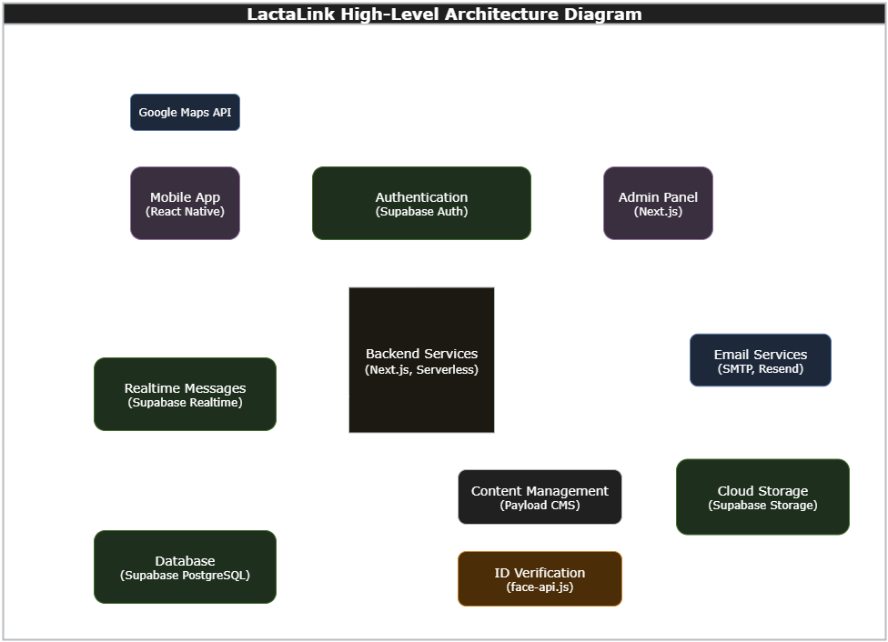

# Technical Architecture

This document provides an overview of the technical architecture of the LactaLink application, detailing the technologies used, system components, and their interactions.

## Technologies Used

- **Frontend**:
  - **React Native (Expo)**: For building the mobile application for both Android and iOS platforms.
  - **React (Next.js)**: For the web admin panel.
- **Backend**:
  - **Next.js**: For server-side rendering and API development.
  - **Payload CMS**: For content management.
- **Database**:
  - **Supabase (PostgreSQL)**: For data storage and management.
- **Authentication**:
  - **Supabase Auth**: For user authentication that integrates **Google OAuth**.
  - **Google OAuth**: For "Sign in with Google" capability, integrated by **Supabase Auth**.
- **State Management**:
  - **React Query**: For managing server state and caching.
  - **Zustand**: For managing client state.
- **API Communication**:
  - **Payload CMS RESTful APIs**: For communication between frontend and backend.
- **Real-time Communication**:
  - **Supabase Realtime**: For enabling real-time features (messages, notifications) in the application.
- **Maps and Location Services**:
  - **Google Maps API**: For integrating maps and location-based functionalities.
- **Email Services**:
  - **Supabase SMTP** and **Payload CMS Email Adapter**: For sending auth-related email notifications.
  - **Resend**: For email delivery services.
- **Identity Verification**:
  - **face-api.js**: For face detection and comparison.

## System Components

### Mobile Application

The mobile app, built with **React Native (Expo)**, serves as the primary interface for donors, recipients, and organizations. It provides features such as:

- User authentication via **Supabase Auth**.
- Location-based services using **Google Maps API**.
- Real-time messaging powered by **Supabase Realtime**.

### Web Admin Panel

The web admin panel, developed with **Next.js**, is designed for administrators. Key functionalities include:

- Content management through **Payload CMS**.
- Administrative tools for managing users, donations, and requests.

### Backend Services

The backend, also built with **Next.js**, handles server-side rendering and API endpoints. It integrates with:

- **Supabase (PostgreSQL)** for data storage.
- **Payload CMS** for content management. See [Payload CMS](./PAYLOAD_CMS.md) for collection configurations and custom API endpoints.
- **Supabase Realtime** for real-time data synchronization.

### Database

The database layer is powered by **Supabase (PostgreSQL)**, which provides:

- Secure data storage.
- Real-time updates and triggers for dynamic interactions.

### Authentication

User authentication is managed by **Supabase Auth**, which supports:

- Email/password authentication.
- **Google OAuth** provider.

More information on authentication flows can be found in the [Authentication Documentation](./AUTHENTICATION.md).

### GIS Integration

**Google Maps API** is utilized for:

- Geocoding and reverse geocoding.
- Displaying maps and location-based search.
- Routing and distance calculations.
- Navigation features.

### Email Services

Email notifications are managed through:

- **Supabase SMTP** for authentication-related emails.
- **Payload CMS Email Adapter** for transactional emails.

### Cloud Storage

- **Supabase Storage** is used for storing files and media assets, integrated with **Payload CMS S3 Adapter** for managing media files.

## Data Flow

1. **User Interaction**: Users interact with the mobile app or web admin panel.
2. **API Requests**: Frontend applications communicate with the backend via RESTful APIs.
3. **Database Operations**: The backend interacts with **Supabase (PostgreSQL)** for data retrieval and storage.
4. **Real-Time Updates**: Changes in the database trigger real-time updates to connected clients using **Supabase Realtime**.
5. **External Services**: Integration with external services like **Google Maps API** and **Resend** email providers ensures seamless functionality.

### High-Level Architecture Diagram

This diagram highlights the core components and their interactions, including external services like Google Maps API and email services.

## Security Considerations

- **Authentication**: All user authentication is handled via **Supabase Auth**.
- **Data Encryption**: Sensitive data is encrypted both in transit and at rest.
- **Access Control**: Role-based access control (RBAC) is implemented to restrict access to sensitive features and data.

## Future Enhancements

- **Scalability**: Implementing horizontal scaling for backend services.
- **Advanced Analytics**: Adding analytics dashboards for better insights.
- **AI Integration**: Exploring AI-driven features for personalized recommendations.

## Performance Considerations

- **Caching**: Implement caching mechanisms for frequently accessed data to reduce database load and improve response times.
- **Load Balancing**: Use load balancers to distribute traffic evenly across backend servers, ensuring high availability and reliability.
- **Database Optimization**: Optimize database queries and use indexing to enhance performance for large datasets.
- **Monitoring and Alerts**: Set up monitoring tools to track system performance and configure alerts for potential bottlenecks or failures.
- **Scalability**: Design the system to handle increased traffic by scaling horizontally (adding more servers) or vertically (upgrading server capacity).
